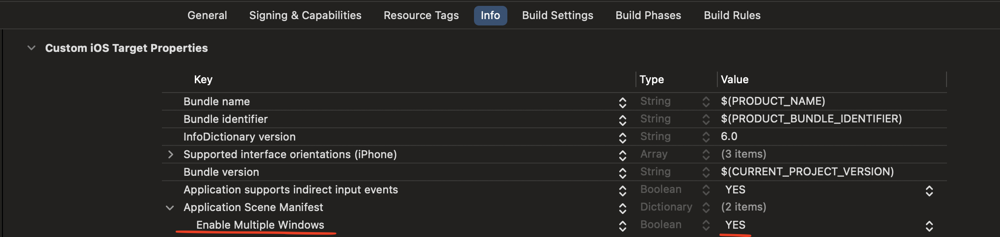
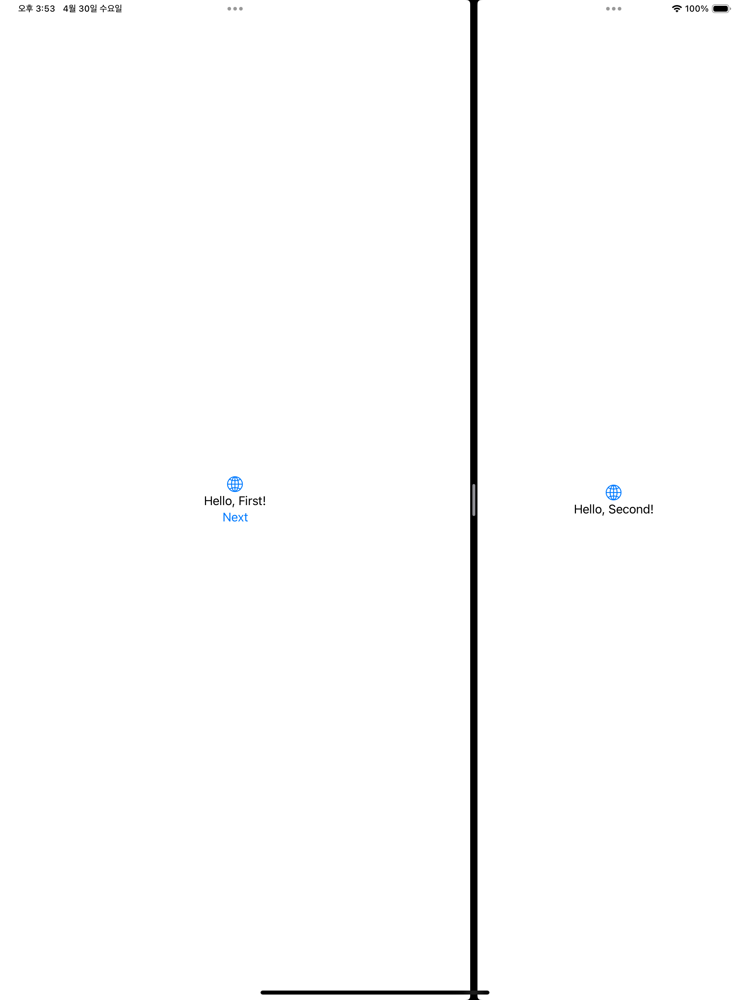

# WindowGroup 구조체

`WindowGroup`은 동일한 구조의 Window(창) 그룹을 나타내는 Scene입니다.

**지원 플랫폼:**
*   iOS 14.0+

**개요:**

```swift
@MainActor @preconcurrency public struct WindowGroup<Content> : Scene where Content : View
```

`WindowGroup`은 앱이 표시하는 뷰 계층 구조의 컨테이너로 사용됩니다. 그룹의 콘텐츠로 선언하는 계층 구조는 해당 그룹에서 앱이 생성하는 각 Window(창)의 템플릿 역할을 합니다.

```swift
@main
struct Mail: App {
    var body: some Scene {
        WindowGroup {
            MailViewer() // 창에 대한 뷰 계층 구조 정의
        }
    }
}
```

macOS 및 iPadOS와 같이 지원하는 플랫폼에서는 여러 창을 동시에 열 수 있으며, macOS에서는 열린 창을 탭 인터페이스로 모을 수 있습니다. 각 창은 독립적인 상태를 유지합니다. 문서 기반 앱의 경우 `DocumentGroup`을 사용합니다.

> 🚨 주의사항
1. iOS 플랫폼에서는 여러 Scene Window(창)을 동시에 지원하지 않습니다.
2. Info.plist의 [Enable Multiple Windows](https://developer.apple.com/documentation/BundleResources/Information-Property-List/UIApplicationSceneManifest/UIApplicationSupportsMultipleScenes) 값을 활성화해야 합니다.  




**프로그래밍 방식으로 Window(창) 열기:**

`id` 또는 presentation type으로 초기화된 `WindowGroup`은 환경에서 `openWindow` 액션을 사용하여 프로그래밍 방식으로 열 수 있습니다.

```swift
// WindowGroup 정의 시 id 부여
WindowGroup(id: "mail-viewer") {
    MailViewer()
}

// 버튼 등에서 openWindow 호출
struct NewViewerButton: View {
    @Environment(\.openWindow) private var openWindow

    var body: some View {
        Button("새 메일 뷰어 열기") {
            openWindow(id: "mail-viewer") // id 일치
        }
    }
}
```

**데이터를 전달하여 창 열기:**

presentation type(`for:`)으로 초기화된 `WindowGroup`은 `openWindow(value:)`를 사용하여 데이터를 전달하며 열 수 있습니다. 전달하는 데이터 타입은 `Hashable` 및 `Codable` 프로토콜을 준수해야 합니다. 동일한 값으로 이미 열린 창이 있으면 새 창 대신 기존 창이 전면으로 이동합니다. 기본값(`defaultValue`)을 지정할 수 있습니다.

```swift
// 메시지 ID를 전달받는 WindowGroup
WindowGroup(for: Message.ID.self) { $messageID in
    MessageDetail(messageID: messageID)
}

// 메시지 ID를 전달하여 창 열기
struct NewMessageButton: View {
    var message: Message
    @Environment(\.openWindow) private var openWindow

    var body: some View {
        Button("메시지 열기") {
            openWindow(value: message.id)
        }
    }
}
```

**창 제목 설정:**

그룹 초기화 시 첫 번째 매개변수로 제목 문자열을 포함하여 창 제목을 설정할 수 있습니다. 이 제목은 파일 > 새로 만들기 메뉴, 창 제목 표시줄, 창 메뉴 목록 등에 사용됩니다. `navigationTitle(_:)` 수정자로 개별 창의 제목을 재정의할 수 있습니다.

```swift
WindowGroup("메시지", for: Message.ID.self) { $messageID in
    MessageDetail(messageID: messageID)
}
```

**동일 데이터 타입의 창 구분:**

동일한 데이터 타입(예: UUID)을 사용하는 여러 `WindowGroup`을 구분하려면 `id` 매개변수를 추가하고 `openWindow(id:value:)`를 사용합니다.

**프로그래밍 방식으로 창 닫기:**

창의 뷰 계층 구조 내에서 환경의 `dismiss` 액션을 호출하여 창을 닫을 수 있습니다. 이 액션은 창에서 모달(sheet, popover)을 닫을 때는 해당 모달만 닫습니다.

> iPad 다중 Scene 예시
